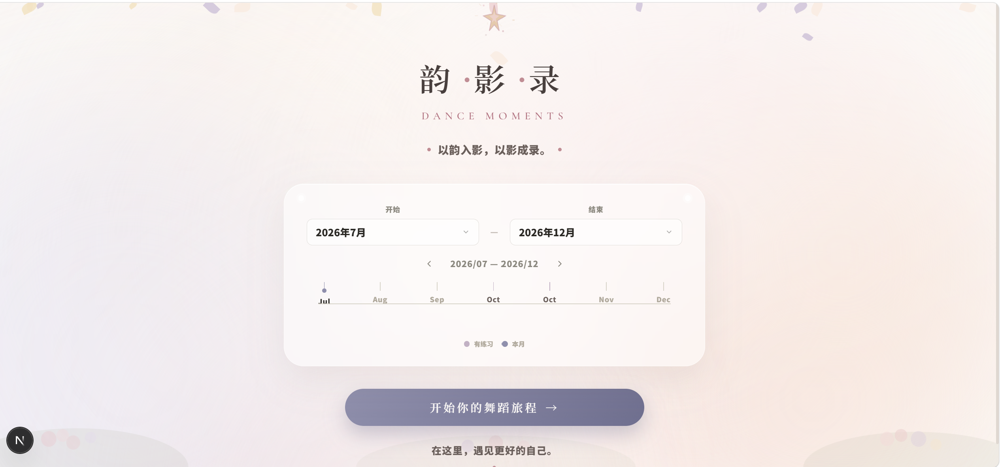
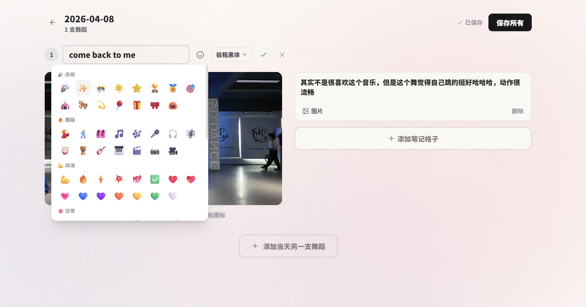
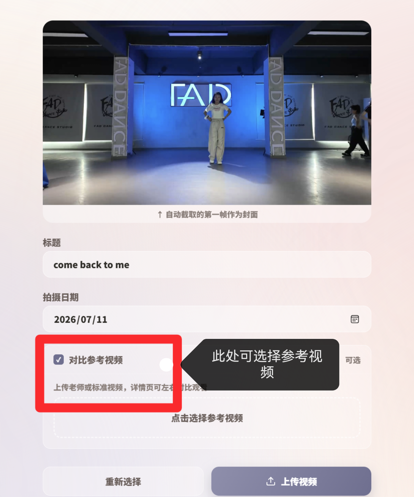

# 韵影录 · Dance Calendar 🩰

> **以韵入影，以影成录。**  
> 用记录，让每一次起舞都有回响。

韵影录是一个为舞者量身打造的视频记录与日历管理工具。你可以上传舞蹈视频、记录每次练习的日期，并通过日历和时间线直观地回顾自己的舞蹈成长历程。

---

## ✨ 功能一览

| 功能 | 说明 |
|------|------|
| 📅 **舞蹈日历** | 按月查看你的舞蹈记录，哪天跳过舞一目了然 |
| ⏳ **时光时间线** | 首页展示最近的舞蹈记录时间轴 |
| 🎬 **视频上传** | 上传舞蹈视频，自动存储到云端（Cloudinary） |
| 📝 **练习笔记** | 每次练习可记录视频、参考视频和文字笔记 |
| 🖼️ **页面截图** | 精美的中式美学界面设计 |

---

## 🖼️ 界面预览

### 🏠 首页



> 诗意风格的主页，包含星光徽章、时光卡片和时间线，氛围感拉满。

### 📅 日历视图



> 按月展示舞蹈记录，每一天都是一个值得纪念的舞步。

### 📤 上传页面


> 上传舞蹈视频、填写标题、选择日期，轻松记录每一次练习。

### 📋 日详情页



> 查看某一天的所有舞蹈记录，支持视频播放和笔记浏览。

---

## 🛠️ 技术栈

| 技术 | 用途 |
|------|------|
| [Next.js 16](https://nextjs.org/) | React 框架（App Router） |
| [React 19](https://react.dev/) | UI 组件库 |
| [TypeScript](https://www.typescriptlang.org/) | 类型安全 |
| [Tailwind CSS 4](https://tailwindcss.com/) | 样式系统 |
| [Prisma](https://prisma.io/) | ORM / 数据库操作 |
| [Neon PostgreSQL](https://neon.tech/) | 云数据库 |
| [Cloudinary](https://cloudinary.com/) | 视频 & 图片云存储 |

---

## 🚀 本地运行

### 前置条件

- Node.js >= 18
- npm / pnpm

### 安装与启动

```bash
# 进入项目
cd dance-calendar

# 安装依赖
npm install

# 启动开发服务器
npm run dev
```

打开 [http://localhost:3000](http://localhost:3000) 即可查看。

### 环境变量

项目需要以下环境变量（在 `.env` 文件中设置）：

| 变量 | 说明 |
|------|------|
| `DATABASE_URL` | Neon PostgreSQL 连接字符串 |
| `CLOUDINARY_CLOUD_NAME` | Cloudinary 云名称 |
| `CLOUDINARY_API_KEY` | Cloudinary API 密钥 |
| `CLOUDINARY_API_SECRET` | Cloudinary API 密钥密码 |

---

## 🌐 部署

本项目可部署到 [Railway](https://railway.app/) 或 [Vercel](https://vercel.com/)：

```bash
# 构建
npm run build

# 启动生产服务器
npm start
```

---

## 📂 项目结构

```
dance-calendar/
├── app/                    # Next.js App Router 页面
│   ├── api/                # API 路由
│   ├── calendar/           # 日历页面
│   ├── day/[date]/         # 日详情页面
│   ├── upload/             # 上传页面
│   ├── layout.tsx          # 根布局
│   └── page.tsx            # 首页
├── components/             # 共享组件
├── lib/                    # 工具函数
├── prisma/                 # 数据库 schema
└── public/                 # 静态资源
```

---

## 👩‍💻 关于作者

由 Scarlett 创建，用代码记录每一次起舞的瞬间。

---

> 🌟 **韵影录** — 在这里，遇见更好的自己。
